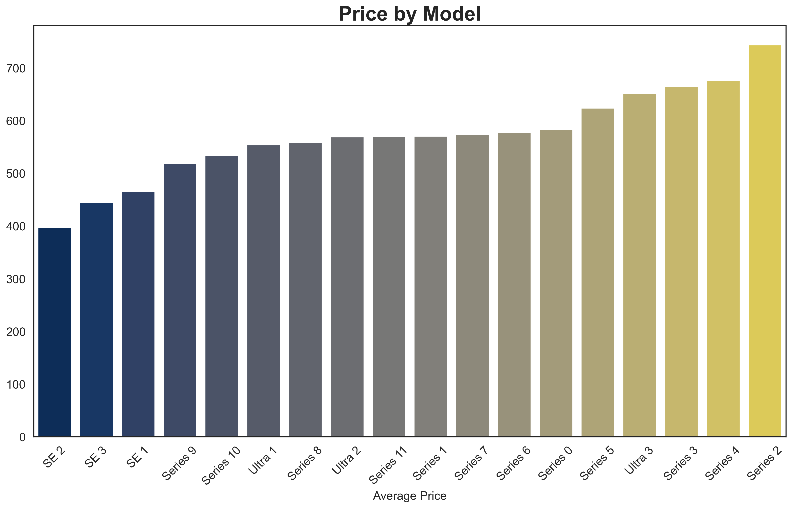
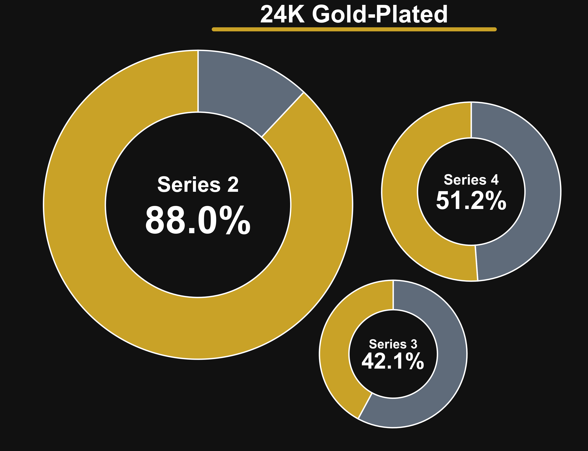
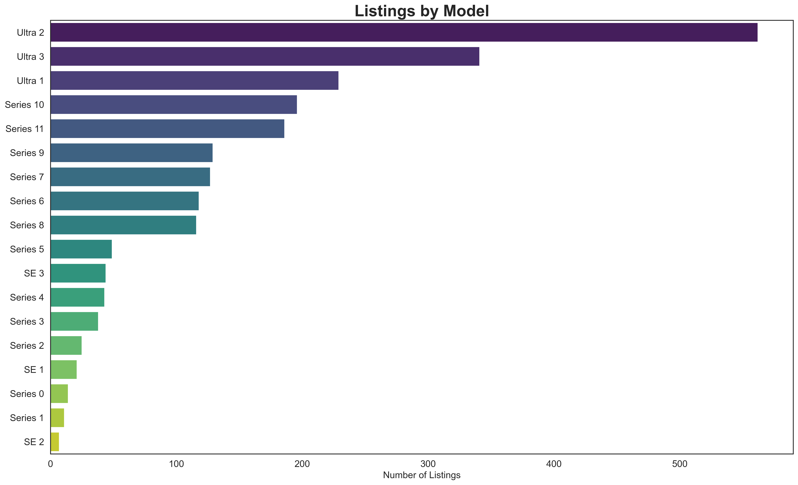
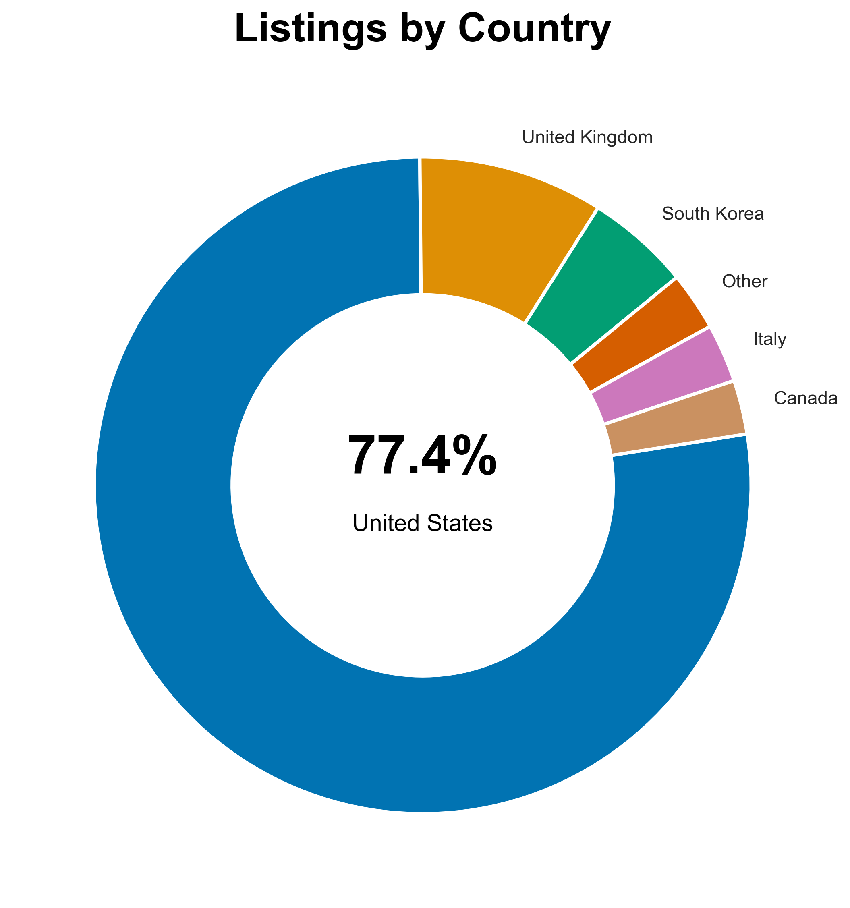
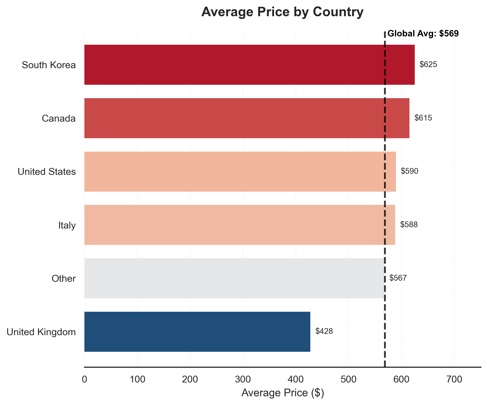
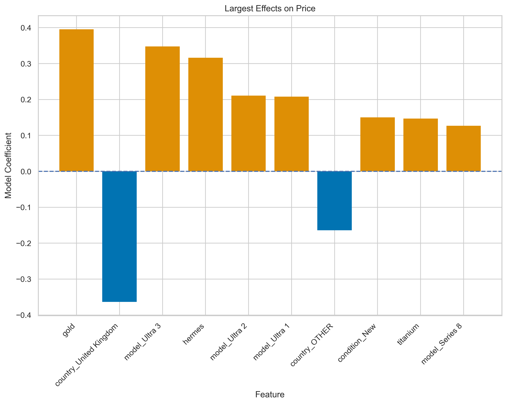
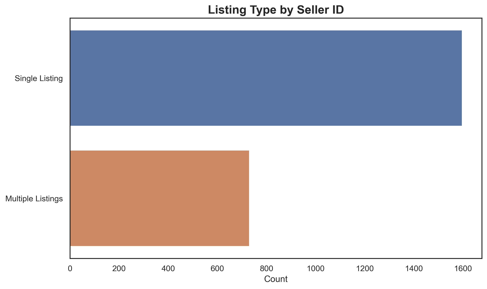
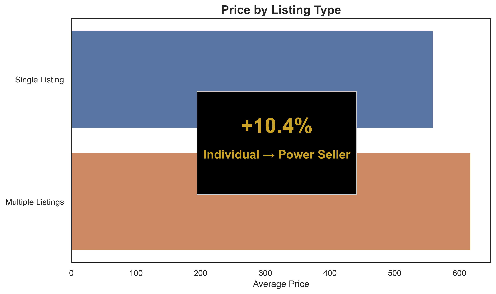

# Plated in Gold: What Drives Apple Smartwatch Resale Prices?

We analyze thousands of third-party Apple smartwatch listings collected from online marketplaces. We focus on smartwatch model, premium markers (special editions and materials), aftermarket additions (such as 24k gold plating), list country, and international shipping availibility.

Our main question is: Which features drive price?

The answer is that aftermarket gold-plating and special edition models contribute most of the dollars to the overall market. Looking only at retail models, i.e. those with no after-market additions, we still see special editions popping up, along with country of origin, model number, and premium options such as titanium case.

## At a Glance
Here are some really cool visuals

  
  

  

  
  

  

  
  

## Table of Contents

- [At a Glance](#at-a-glance)
- [Overview](#overview)
- [Dataset](#dataset)
- [Methodology](#methodology)
- [Analysis](#analysis)
- [Regression Model](#regression-model)
- [Key Findings](#key-findings)
- [Limitations](#limitations)

## Overview

What dataset contains, why interesting, question to answer, approach

## Dataset
Where did it come from
  Web-scraped

What does the raw data look like. 

Explain columns:
  Brand - Apple, Garmin, Xiaome, or Other
  Condition - New, Used, Open-Box, etc.
  Case_Size_mm - Size of smartwatch
  Country - Country of origin
  Price - In USD
  Seller_ID - Uniquely identifies each seller
  Is_Worldwide_Shipping - Boolean
  Title - the listing title

Give stats 
  number of entries
  price range
  number of countries
  number of models

## Methodology
Explain workflow:

How did we clean data?
  Standardized names and entries
  Removed non smartwatch things
  Clean condition column?

Which features were engineered?
  Model
  Family
  Gold/Hermes/Titanium

Analysis methods
  OLS model
  ANOVA

## Analysis

  ### Model
    -price differences by model
    -count differences by model
    -what is surprising
    -gold
    -hermes

    Limitations
      Left-skewedness of model distributions

  ### Country
    -Average prices by country
    -Average price differences by country
    -UK deep dive

    Limitations
      US dominates listings
    

  ### Condition
    -New vs Used vs Open Box?

    Limitations
      No post info, sometimes contradicts title

  ### Case size
    -price by case size
    -Ultra 1,2,3 deep dive?
    -Gold/Hermes deep dive?

  ### Shipping
    -shipping effects
    -shipping and country correlation

  ### Seller ID
    -individual vs power seller

## Regression Model
Show OLS model results
  - interpret coefficients

## Key Findings
Most important takeaways
  Bullet points
    Aftermarket plating
    Old models listed high
    

  

## Limitations
Missing variables
  - Post description 🔋

Listings, not sales

