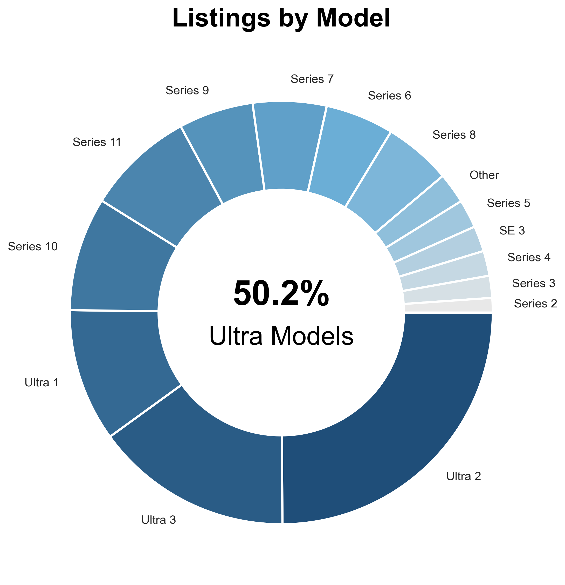

# Plated in Gold: What Drives Apple Smartwatch Resale Prices?

We analyze thousands of third-party Apple smartwatch listings collected from online marketplaces. We focus on smartwatch model, premium markers (special editions and materials), aftermarket additions (such as 24k gold plating), list country, and international shipping availibility.

Our main question is: Which features drive price?

The answer is that aftermarket gold-plating and special edition models contribute most of the dollars to the overall market. Looking only at retail models, i.e. those with no after-market additions, we still see special editions popping up, along with country of origin, model number, and premium options such as titanium case.

## Overview

What dataset contains, why interesting, question to answer, approach

## At a Glance
2,328 entries
1430 different sellers
20 Countries
19 Apple Smartwatch models

  
  

  

  
  

  

  
  

## Table of Contents

- [At a Glance](#at-a-glance)
- [Overview](#overview)
- [Dataset](#dataset)
- [Methodology](#methodology)
- [Analysis](#analysis)
- [Regression Model](#regression-model)
- [Key Findings](#key-findings)
- [Limitations](#limitations)

## Dataset
The raw data is web-scraped from online marketplaces. It contains the following columns:

  Brand - Apple, Garmin, Xiaome, or Other
  Condition - New, Used, Open-Box, etc.
  Case_Size_mm - Size of smartwatch in mm
  Country - Country of listing
  Price - In USD
  Seller_ID - Uniquely identifies each seller
  Is_Worldwide_Shipping - True or False
  Title - the listing title

Before cleaning and filtering by brand, there are were 3607 rows and a price range of $120 - $49900. Apple products account for 66% of the total listings.

## Methodology
### Cleaning the Data:
We first standardized the text entries (Brand, Condition, Country, and Title), removing accents and special characters and rendering everything in lower case. We then filtered out non Apple products. 

We used regex to identify bundle listings (such as smartwatch plus iphone) as well as listings containing multiple broken smartwatches for parts. At this point we removed the listing for $49900, assumming it to be a mistake. 

Both the Condition and the Country columns contained entries in Spanish and English, so we standardized to English. We noticed inconsistencies between the Condition column and the Title column. For example, the title claims "Brand New", yet the condition is listed as "Used". In these cases, we replaced what was in the Condition column with what we found in the Title. We used regex for the extraction.

### Feature Engineering
#### Model
We created a 'model' column by extracting the family and model number from the Title column. Of the 2328 entries, only 72 did not contain the model information in the title. The model column enjoys representatives from every generation of Apple smartwatch released.

#### Luxury Markers
We then used regex to search for 24k gold-plated editions. This is an aftermarket addition that dramatically increases the list price. We tallied this information in a binary column called 'gold' which contains a 1 if the watch is plated, and 0 otherwise.

We also created a binary column called 'hermes' which indicates if the watch is a Hermès special edition. We extracted this with regex on the Title column.

We then extracted, using regex, several other luxury markers including 'cellular', 'titanium', 'premium_band', and 'ceramic'. The premium_band column identifies watches with the optional Milanese Loop - a stainless steel premium option. The ceramic column markes watches with the premium ceramic case back.

### Power-Sellers
Finally, we looked at the seller_id column and marked those sellers with 2 or more listings as 'power-sellers'. The rest we refer to as 'individuals'.

### Analysis Methods
#### Data Preprocessing
In the
rare categories
dropped cats
dummy vars - drop first=True

We used a statsmodels Ordinary Least Squares linear regression model to fit the data.

scaled coefficients by S_X/S_y

Analysis methods
  OLS model
  ANOVA

## Analysis

  ### Model Results
  The model R**2 is .414, meaning that about 40% of the variance in price is explained by the model. The other 60% is something else, could be factors in the description, who knows? See the Limitations section.

  And the MAE is $86, so on average the model precicted price to within $86. 

  Most importantly, the coefficients of the model give us a ranking of feature importance. The model looks something like this:

$$\text{Price} \approx \beta_{0} + \beta_1 * \text{Country} + \beta_2 *\text{Condition} + \beta_3*\text{Model} + \beta_4*\text{gold} \cdots $$

The $\beta$'s are numbers decided by the computer, that we call the coefficients, or weights. Generally, the greater the number (in absolute value), the more influence that factor has on price. Th

    -price differences by model
    -count differences by model
    -what is surprising
    -gold
    -hermes

    Limitations
      Left-skewedness of model distributions

  ### Country
    -Average prices by country
    -Average price differences by country
    -UK deep dive

    Limitations
      US dominates listings
    

  ### Condition
    -New vs Used vs Open Box?

    Limitations
      No post info, sometimes contradicts title

  ### Case size
    -price by case size
    -Ultra 1,2,3 deep dive?
    -Gold/Hermes deep dive?

  ### Shipping
    -shipping effects
    -shipping and country correlation

  ### Seller ID
    -individual vs power seller

## Regression Model
Show OLS model results
  - interpret coefficients

## Key Findings
Most important takeaways
  Bullet points
    Aftermarket plating
    Old models listed high
    

  

## Limitations
Missing variables
  - Post description 🔋

Listings, not sales

